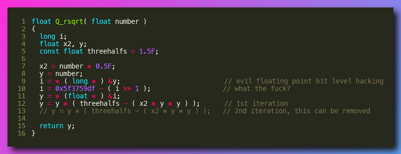

# Code Nitro
Ever want to share your code as an image? Code Nitro can do that. Code Nitro is lightweight, has only two dependencies, and works online and offline.

Don't need to send your code to third parties, use Code Nitro.

## Installation
Clone this repo to somewhere cool, install the dependencies, and add an alias to your `.bash_profile` (or whichever profile file you use).

```bash
cd ~/Desktop
git clone ...
cd code_nitro
python3 -m pip install -r requirements.txt
echo "alias nitro=\"python3 $(pwd)/nitro.py\"" >> ~/.bash_profile
source ~/.bash_profile
```

And that's it.

## Demo



## Features
There are three main features.

1. Convert an entire file to an image. Code Nitro will save it in the same directory with the same name (but with .png).

```bash
nitro my_code.py
```

2. Convert only part of a file by using `--lines`. For example, `--lines=5-10` will print lines 5 through 10, inclusive.

```bash
nitro my_code.py --lines=5-10
```

3. Download a file from GitHub and convert it to an image. You don't need to do anything special, just include the url in place of the filename.

```bash
nitro https://github.com/lukesalamone/code_nitro/blob/master/nitro.py
```
