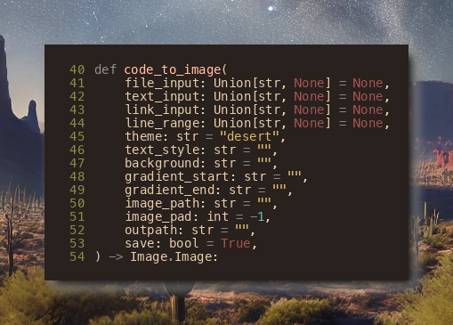
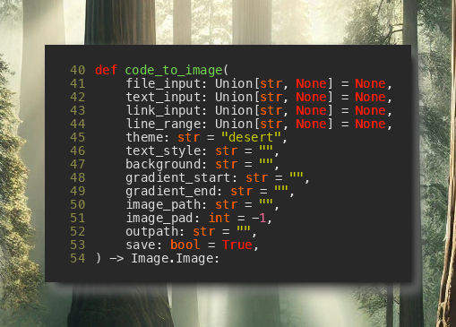
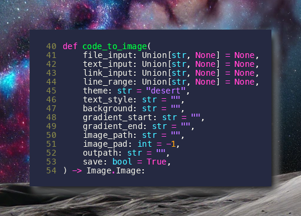
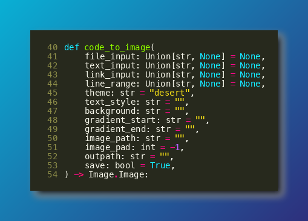
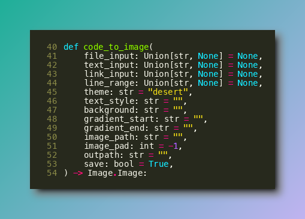

# 🔥Code Nitro: Code to Image from the Command Line
Ever want to share your code as an image? Code Nitro can do that. Code Nitro is lightweight, has minimal dependencies, and works online and offline.

Don't send your code to third parties, use Code Nitro.

## 🛠️Installation
You can install the `nitro` command with pip.

```bash
pip install codenitro
```

## 🎬 Examples
```bash
nitro nitro.py --lines=40-54 --theme=desert
```

```bash
nitro nitro.py --lines=40-54 --theme=forest
```

```bash
nitro nitro.py --lines=40-54 --theme=moon
```

```bash
nitro nitro.py --lines=40-54 --theme=blue
```

```bash
nitro nitro.py --lines=40-54 --theme=cool
```


## ⭐Features

1. Convert an entire file to an image via command line. By default, Code Nitro will save it in the same directory with the same name (but with .png).

```bash
nitro my_code.py [options]
```

2. Convert only part of a file by using `--lines`. For example, `--lines=5-10` will print lines 5 through 10, inclusive.

```bash
nitro my_code.py --lines=5-10
```

3. Download a file from GitHub and convert it to an image by including the url in place of the filename.

```bash
nitro https://github.com/lukesalamone/code_nitro/blob/master/nitro.py
```

## 🐍 Python API

You can also import `codenitro` and call the exposed `code_to_image()` function programmatically.
```python
from codenitro import code_to_image

image = code_to_image(
    file_input="HelloWorld.java"
    lines="23-34",
    save=False # optionally return result rather than saving
)

print(type(image))
# "PIL.Image.Image"

```

## 🎨 Themes

Nitro comes with a few themes out of the box. Creating your own theme is easy as well. Just update your theme file in `~/.config/codenitro/themes.json`
